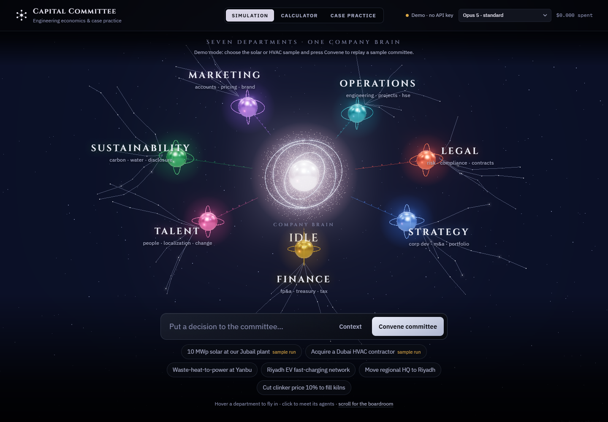
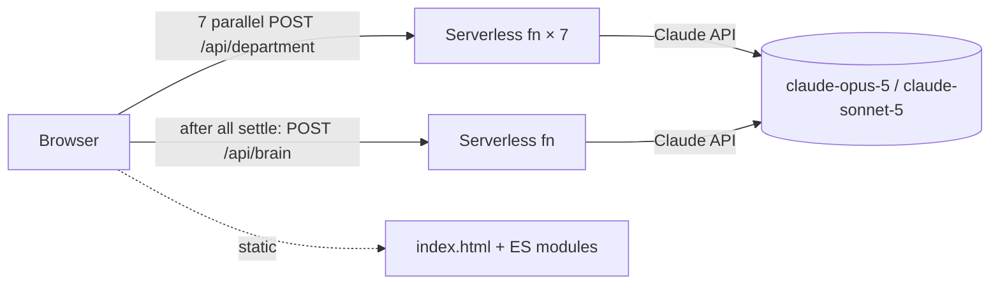

# Capital Committee

**Engineering economics & case practice.** Put a capital decision in front of a simulated investment committee of seven Claude-powered departments, model it with NPV / IRR / tornado sensitivity, and drill consulting case interviews, all grounded in sourced GCC and industry figures.



## Three modes

### 1. Company Simulation (main page)
A decision runs through seven department agents, **in parallel**, each a separate Claude call with its own persona:

| Department | Argues from | Characteristic bias (kept on purpose) |
|---|---|---|
| Finance | NPV/IRR vs hurdle, payback, covenant headroom | Underweights option value and long horizons |
| Strategy & Corp Dev | Right to win, timing, build/borrow/buy | Optimistic about upside; treats execution as detail |
| Legal & Risk | Exposure, conditions precedent, RAPID "Agree" veto | Defensibility over expected value |
| Operations & Engineering | FEL stage, AACE estimate class, HSE, critical path | Wants one more stage of definition |
| Marketing & Sales | Bottom-up SOM, win rates, LTV:CAC | Optimistic demand, light on cost-to-serve |
| Sustainability & ESG | GHG scopes, SBTi / SGI / UAE Net Zero, IFRS S2 | Underweights near-term cash |
| HR & Talent | Capability gaps, Nitaqat / Emiratisation, ADKAR | "The organisation isn't ready" |

Each returns a schema-validated verdict (stance, confidence, 2–3 reasons, one risk flag, conditions, key metric). Only after all seven settle does the **Company Brain** rule. It acts as the RAPID "D", honours Legal and safety vetoes, corrects for each function's known bias, names the single hinge trade-off, and sets owned conditions and kill criteria.

- **Boardroom ↔ Quick verdict** views
- **Culture weight sliders** (finance-driven, engineering-driven, sustainability-first, growth-led). The weighted lean is computed deterministically and updates live; re-convening the Brain is one extra call.
- **Show disagreement** draws the conflicts on the map and filters the cards to departments that clash
- **"Your call" panel.** The Brain always rules, but flags close high-severity conflicts that turn on risk appetite so a human can overrule it
- Departments can be switched off per run; IC memo export (print to PDF); run history kept in the browser

### 2. Calculator
An assumptions sheet (blue = input, financial-model convention), a live WACC slider with GCC reference bands, and NPV, IRR, MIRR, simple and discounted payback, PI and LCOE. Four exhibits in consulting style, each with a "so what" action title, footnotes and a source line:
1. **Tornado** sorted by swing, engineering low/high ranges (toggle to ±20%), coloured by input level, not outcome
2. **NPV profile** against discount rate, with the IRR crossing marked
3. **Breakeven table**: how far each input can move before NPV = 0
4. **Cash-flow schedule**

Presets: 10 MWp factory solar (KSA), 5 MWe waste-heat-to-power (cement), SWRO energy-recovery retrofit (UAE), and a deliberately negative battery-arbitrage case. **Send to the committee** attaches the results as a committee pack, so Finance argues from your numbers.

### 3. Case Practice
16 original cases: 8 strategy (market sizing, profitability, breakeven, pricing, market entry, M&A) and 8 technical (energy go/no-go, LCOE/LCOW, debottlenecking, district cooling, plant efficiency). 12 are set in the Gulf.
- Entry-level ↔ advanced toggle, calibrated against public casebooks; each case is tagged with its difficulty drivers (trap, multi-stage, second-order effects…) and interview format (interviewer-led, candidate-led, engineering consulting)
- Timer, exhibits you request one at a time, a framework hint that nudges without giving the answer, then a reveal of the model issue tree, reasoning, answer and the partner-style synthesis
- Self-scoring on the four-part rubric, plus optional **AI interviewer feedback**
- Progress history (attempts, rubric averages, frameworks practised) persists in the browser

## Architecture



- **The API key never reaches the browser.** Vercel serverless functions in `/api` hold `ANTHROPIC_API_KEY` and proxy every call. An optional `APP_PASSCODE` protects your budget on a public URL, and a best-effort per-IP limiter caps abuse.
- **Parallelism happens in the browser.** Seven independent function invocations, so cards land as each department finishes and wall-clock time is roughly one call plus the Brain, not eight in sequence.
- **Structured outputs** (`output_config.format` with JSON Schema) guarantee parseable verdicts; adaptive thinking; server-side refusal fallback on Opus 5; the persona system prompts are prompt-cached.
- **No build step.** Vanilla ES modules and hand-drawn SVG charts, plus one dependency (`@anthropic-ai/sdk`).
- **Without a key** the site runs in demo mode and replays sample committees for two decisions.

## Cost per run (list prices, Sep 2026)

| Tier | Departments | Brain | Typical full run |
|---|---|---|---|
| Standard | Opus 5 ($5 / $25 per M tokens) | Opus 5 | **≈ $0.40** |
| Economy | Sonnet 5 ($2 / $10) | Opus 5 | **≈ $0.20** |

Roughly 1.3K input and 1.5K output tokens per department (including adaptive thinking) and about 5K / 2.5K for the Brain. The header shows the actual spend from each response's `usage`.

## Run locally

```bash
npm install
echo "ANTHROPIC_API_KEY=sk-ant-..." > .env.local
npm run dev        # http://localhost:5173
npm test           # finance engine checks against the research sanity figures
```

## Deploy (Vercel)
Import the repo in Vercel, add `ANTHROPIC_API_KEY` (and optionally `APP_PASSCODE`) under Environment Variables, and deploy. No build settings are needed.

## Research
Every default is sourced in [`docs/research`](docs/research):
- [finance.md](docs/research/finance.md): WACC ranges (Damodaran Jan 2026 CRPs, IRENA, IEA, Lazard), GCC IPP tariffs, preset inputs, tornado conventions
- [cases.md](docs/research/cases.md): frameworks, difficulty calibration, and the case bank with script-checked arithmetic (the app's case data is generated from this file: `npm run build:cases`)
- [departments.md](docs/research/departments.md): how each function argues in real investment committees, and how leadership teams resolve conflict (RAPID, one-way/two-way doors, pre-mortems)

GCC tariffs and regulations change often; figures marked as estimates are triangulated, not published. Not investment advice.

## Project layout
```
api/            serverless functions: department, brain, coach, health
api/_lib/       Claude client, personas + JSON schemas
js/             app shell, simulation, constellation map, calculator, practice, finance engine
docs/research/  sourced research behind every default
scripts/        case-bank generator
tests/          finance engine tests
```

MIT licensed. Built with the Claude API.
